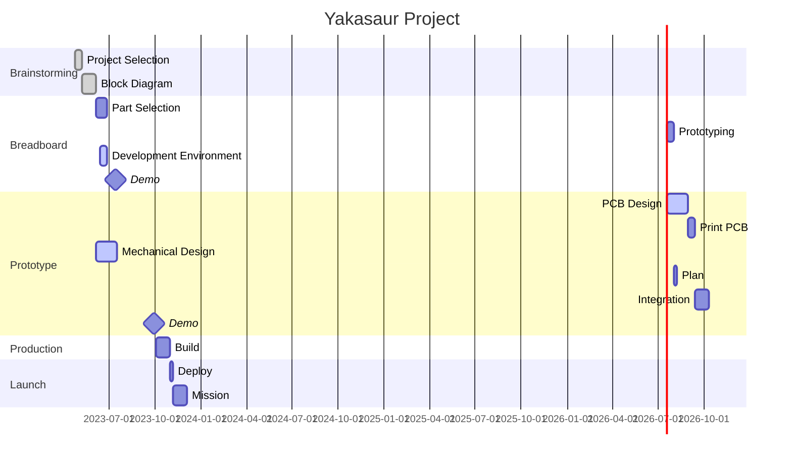

# yakasaur

Roving the Earth on Two Wheels

Part of the [Yak Rover](https://github.com/The-Yak-Collective/yakrover) project.

## Project Phases

### 1. Brainstorming / Mission Selection

Platform: 2-wheel + Tail, Solar, Eyes (camera), Ears (mic) and Cell-enabled communication.

Mission:

* Launch in desert (tbd).
* Observe wildlife and insects.
* Movement  by tele-operation.
* Survive for 4 weeks.

### 2. Breadboard

Take some of the parts we've selected and wire together to provide a platform for software work.

Selected Components:

* [ESP32-S3 WROOM CAM board](https://www.amazon.com/gp/product/B0BMQ8F7FN/ref=sw_img_1?smid=AV3WCPW70PEXC&psc=1)
* [Blues Note LTE-M](https://shop.blues.io/products/note-nbna-500)
* [Zephyr RTOS](https://docs.zephyrproject.org/latest/introduction/index.html)

Capabilities:

* Receive commands over cell and wifi (configurable, for development)
* Broadcast telemetry (GPS, battery level, system information) to server (ground station) on a schedule (something on the order of hours)
* Low power mode selection and schedule
* Capture and upload photo

### 3. Prototype

Construct rover that can move but without final PCB and ruggedness.

### 4. Production

Construct final rover.

### 5. Launch

Deploy final rover in desert. Operate for at least 4 weeks.

## Schedule

There is no deadline, but this chart provides general overview of where we think we are.

## Component Projects

### Mission Planning

### Mechanical Design

### Power

### Electronics

### Vision / Camera

### Audio

### Flight Software

### Ground Control Software
