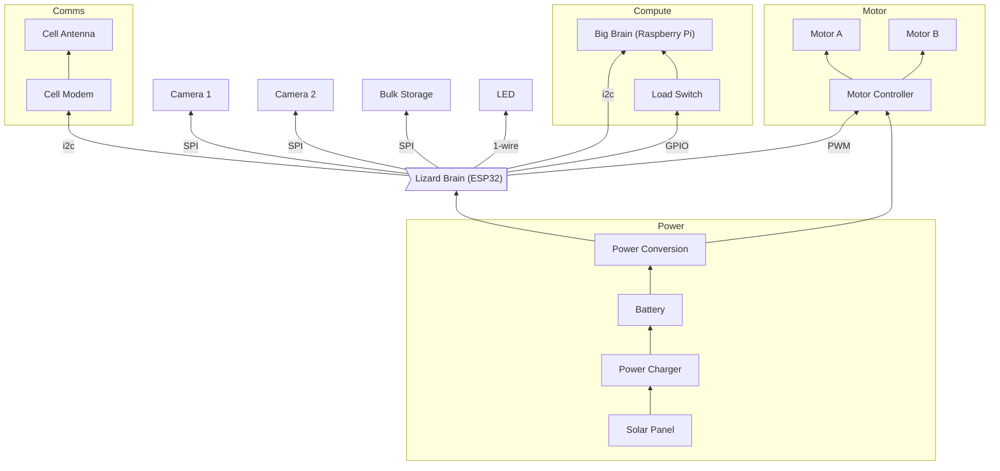

# Electrical Component Block Diagram

```mermaid
graph BT
    ESP32>"Lizard Brain (ESP32)"]

    Camera1["Camera 1"]
    Camera2["Camera 2"]
    BulkStorage["Bulk Storage"]

    MotorController["Motor Controller"]
    MotorA["Motor A"]
    MotorB["Motor B"]

    CellModem["Cell Modem"]
    CellAntenna["Cell Antenna"]

    LED["LED"]

    PowerCharger["Power Charger"]
    PowerConversion["Power Conversion"]
    Battery["Battery"]
    SolarPanel["Solar Panel"]
    
    BigBrain["Big Brain (Raspberry Pi)"]
    LoadSwitch["Load Switch"]

    ESP32 -->|SPI| Camera1
    ESP32 -->|SPI| Camera2
    ESP32 -->|SPI| BulkStorage
    ESP32 -->|i2c| CellModem
    ESP32 -->|1-wire| LED
    ESP32 -->|i2c| BigBrain
    ESP32 -->|GPIO| LoadSwitch

    subgraph Power
        Battery --> PowerConversion 
        PowerCharger --> Battery
        SolarPanel --> PowerCharger
    end
    PowerConversion --> ESP32

    subgraph Motor
        MotorController --> MotorA
        MotorController --> MotorB
    end
    ESP32 -->|PWM| MotorController
    PowerConversion --> MotorController

    subgraph Compute
        LoadSwitch --> BigBrain
    end

    subgraph Comms
        CellModem --> CellAntenna
    end
```